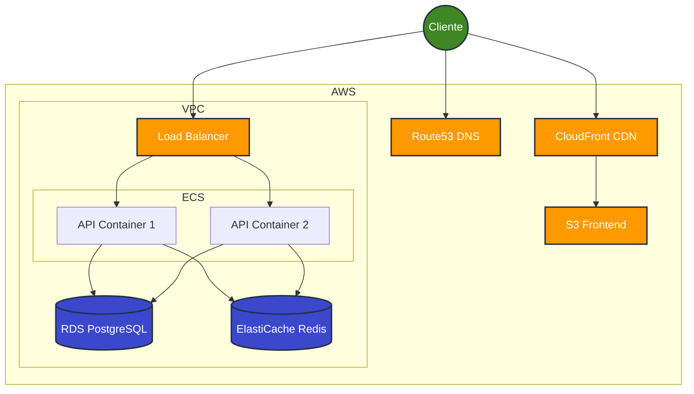

# Arquitetura AWS: Visão 2 - SaaS Enterprise (Alta Disponibilidade)

Este documento detalha a arquitetura de referência para deployments de alta escala, utilizando serviços gerenciados da AWS para maximizar disponibilidade, segurança e reduzir overhead operacional.

## Diagrama de Arquitetura

## Componentes Chave

### 1. Frontend: Distribuição Global (S3 + CloudFront)
- **Hospedagem:** Arquivos estáticos (HTML, JS, CSS) gerados pelo build do React/Vite armazenados no **Amazon S3**.
- **Entrega (CDN):** **Amazon CloudFront** distribui o conteúdo globalmente com baixa latência, fazendo offloading do tráfego.
- **Benefícios:** Custo próximo de zero para storage, carregamento instantâneo via CDN, e SSL gerenciado automaticamente.

### 2. Backend: Containers Gerenciados (ECS Fargate)
- **Runtime:** Bun + Elysia via container Docker.
- **Orquestração:** **Amazon ECS com Fargate** (Serverless Compute). Elimina a necessidade de gerenciar instâncias EC2 e patching de SO.
- **Escalabilidade:** Auto-scaling baseado em métricas (CPU/Memória). Novos containers sobem automaticamente durante picos.
- **Entrada:** **Application Load Balancer (ALB)** lida com terminação SSL e roteamento de tráfego para os containers.

### 3. Banco de Dados Geospacial (RDS PostgreSQL)
- **Serviço:** **Amazon RDS** para PostgreSQL.
- **Extensão:** PostGIS habilitado nativamente (`CREATE EXTENSION postgis;`) para suporte robusto a dados geoespaciais.
- **Gerenciamento:** Backups automáticos, updates de segurança e opção de Multi-AZ para alta disponibilidade.

### 4. Cache e Sessões (ElastiCache Redis)
- **Serviço:** **Amazon ElastiCache** for Redis.
- **Função:** Armazenamento de sessões distribuídas (**Better-Auth**) e cache de permissões (RBAC).
- **Performance:** Latência < 1ms, essencial para validar tokens e sessões em alta frequência sem sobrecarregar o banco principal.

### 5. DNS e Segurança
- **Amazon Route 53:** Gerenciamento de domínios e health checks.
- **Segurança:** O banco de dados e o Redis ficam em subnets privadas, acessíveis apenas pelos containers do ECS, sem exposição pública direta.

## Trade-offs (Análise Tech Lead)

| Característica | Impacto | Análise |
| :--- | :--- | :--- |
| **Custo** | Moderado/Alto | Mais oneroso que VPS simples devido aos serviços gerenciados (ALB, RDS), mas paga-se pela confiabilidade e redução de ops. |
| **Complexidade** | Média | Exige configuração de VPC, IAM Roles e Security Groups corretos. CI/CD deve ser robusto para build/push de imagens Docker. |
| **Manutenção** | Baixa | "Zero infra" gerenciada manualmente. Foco total na aplicação, deixando a AWS cuidar do hardware e SO. |
| **Escalabilidade** | Alta | Componentes desacoplados permitem escalar cada camada independentemente (Frontend na CDN, Backend no ECS, Banco no RDS). |
